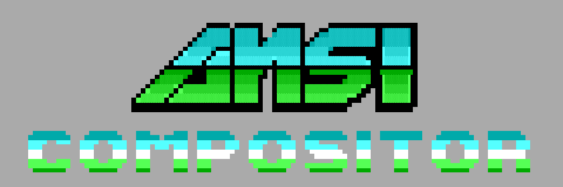
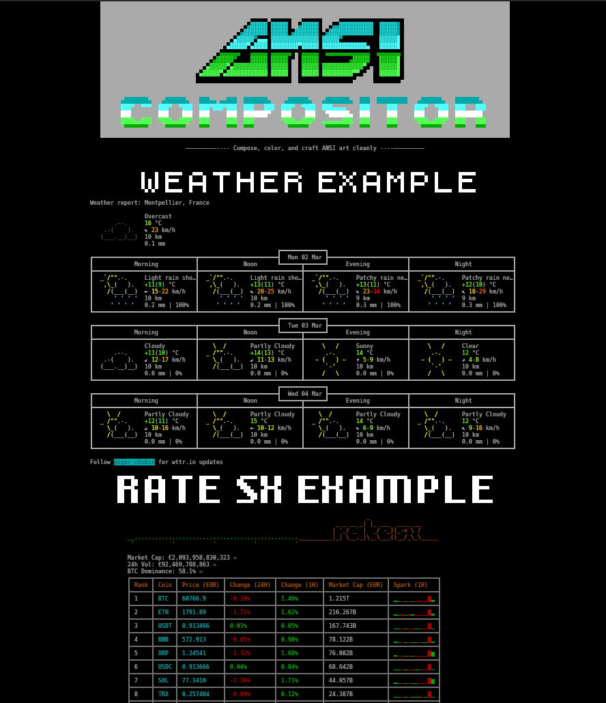

<div align="center">
    <h1>
        
    </h1>
</div>

Compose ANSI/Neotex files from a YAML description. ansi-compositor relies on
splitans for parsing/tokenizing ANSI or Neotex sources and exporting the final
buffer.

## Usage

```bash
ansi-compositor path/to/config.yaml
```

CLI options: `-o` (output file), `-F` (format: ansi|neotex|plaintext), `-I`
(inline), `-K` (keep trailing empty lines), `-v` (VGA colors), `-V` (version).
These override `output.file`, `output.format`, `output.inline`,
`output.keepTrailingLines`, and `term.vgaColors` from the YAML. SAUCE is
controlled only via YAML.

## Configuration

Key YAML fields:

- `term.width`, `term.height`: workspace dimensions (required).
- `term.fill`: optional background (char + neotex style).
- `term.vgaColors`: enable VGA palette for splitans rendering.
- `defaults.inputFormat`: auto|ansi|neotex|plaintext; `defaults.inputEncoding`:
  utf8|cp437|cp850|iso-8859-1; `defaults.boxError`: none|rectangle|fill;
  `defaults.boxErrorPattern`: fill pattern (fill only)
- `layers[]`: each layer has `x`, `y` (1-indexed) and exactly one source among
  `file` | `cmd` | `content`; `cmd` can be a shell string or a list of args.
  Alignment options: `alignH`, `alignV`, `crop`. Error fallback: `boxError`
  (override defaults) only applies to `cmd` layers: rectangle|fill. `none`
  disables it. `boxErrorPattern` overrides the default fill pattern for
  `boxError: fill`.
- `output.format`: ansi|neotex|plaintext; `output.inline`: bool;
  `output.keepTrailingLines`: preserve trailing empty lines (ansi/neotex);
  `output.file`: path.
- `sauce`: optional block (see below).

## Error boxes

`boxError` draws a fallback box when a `cmd` layer fails. Values:

- `none`: no fallback (default).
- `rectangle`: border + centered label/error text.
- `fill`: pattern fill + border + centered label/error text.

`boxErrorPattern` is only used with `boxError: fill`. The pattern is tiled
across the fill area and may be multi-line. If omitted, the fill defaults to
`#`.

Literal block (recommended for spaces):

```yaml
boxErrorPattern: |
  / __ \ \__/
  / /  \ \____/
  \ \__/ / __ \
   \____/ /  \
```

Quoted string (escape newlines and backslashes):

```yaml
boxErrorPattern: "  / __ \\ \\__/\n / /  \\ \\____/\n \\ \\__/ / __ \\\n  \\____/ /  \\"
```

## SAUCE via YAML

- If the `sauce` block is absent: no SAUCE is exported.
- If present: SAUCE is exported (unless `enabled: false`).
- Strict length limits (error if exceeded): `title` ≤ 35, `author` ≤ 20, `group`
  ≤ 20, `font` (TInfoS) ≤ 22.
- Date: `YYYYMMDD` or `YYYY-MM-DD`.
- Supported for `output.format` ansi and neotex; ignored for plaintext.

Available fields:

```yaml
sauce:
  enabled: true # optional, defaults to true when block exists
  title: "My Art"
  author: "Bruno Adele"
  group: "Demo"
  date: "20250208"
  font: "80x25"
  iceColors: true
```

## Example

A sample `ansi-compositor` result



For more examples see the [./examples](./examples/) folder

### Complete example

```yaml
term:
  width: 180
  height: 180
  encoding: utf8

defaults:
  inputFormat: ansi
  inputEncoding: utf8
  boxError: fill
  boxErrorPattern: "  / __ \\ \\__/\n / /  \\ \\____/\n \\ \\__/ / __ \\\n  \\____/ /  \\"

output:
  format: neotex

layers:
  - name: logo
    x: 1
    y: 1
    alignH: center
    # cmd: curl 'https://codef-ansi-logo-maker-api.santo.fr/api.php?text=ansi%20compositor&font=78&spacing=2&spacesize=5&vary=2'
    file: logo.neo
    inputFormat: neotex
  - name: slogan
    x: 1
    y: 22
    width: 180
    height: 1
    alignH: center
    content: "—————————---- Compose, color, and craft ANSI art cleanly ----—————————"
  - name: weather-title
    x: 3
    y: 26
    alignH: center
    cmd: bit -font 8bitfortress -fit-scales -1,0,1,2  -fit-height 3 -fit-priority height -fit-limit 1 "WEATHER EXAMPLE"
  - name: weather
    x: 1
    y: 30
    height: 39
    alignH: center
    cmd: sh -c 'set -euo pipefail; curl --fail -s --max-time 5 wttr.in'
  - name: ratesx-title
    x: 1
    y: 70
    alignH: center
    cmd: bit -font aqui -fit-scales -1,0,1,2  -fit-height 5 -fit-priority height -fit-limit 1 "RATE SX EXAMPLE"
  - name: ratesx
    x: 1
    y: 76
    alignH: center
    cmd: sh -c 'set -euo pipefail; curl --fail -s --max-time 2 https://eur.rate.sx/'
```
