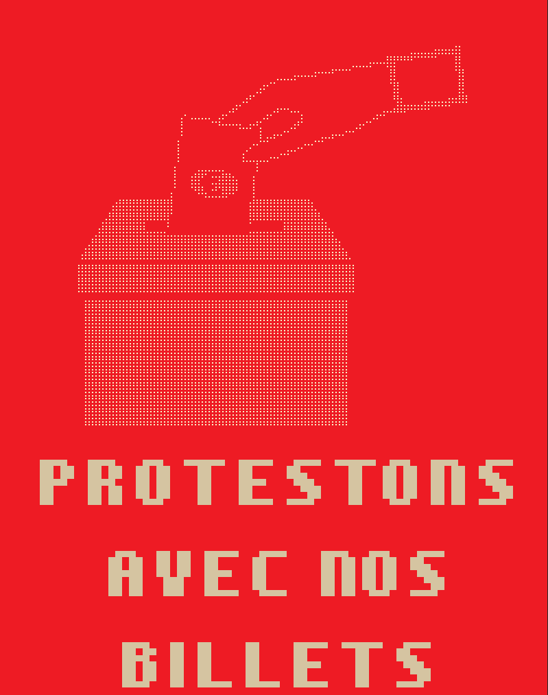

# ballot-vote

```bash
ansi-compositor ballot-vote.yaml -F ansi | splitans -K -N 55 | sed 's/FFFFFFF/Fw/g' | sed 's/Bk/BEE1B24/g'| sed 's/R0/BEE1B24/g' | splitans -f neotex -F ansi
```



source:

- https://github.com/badele/money-as-protest/tree/main
