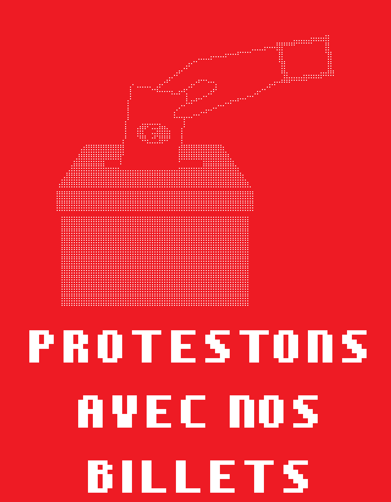
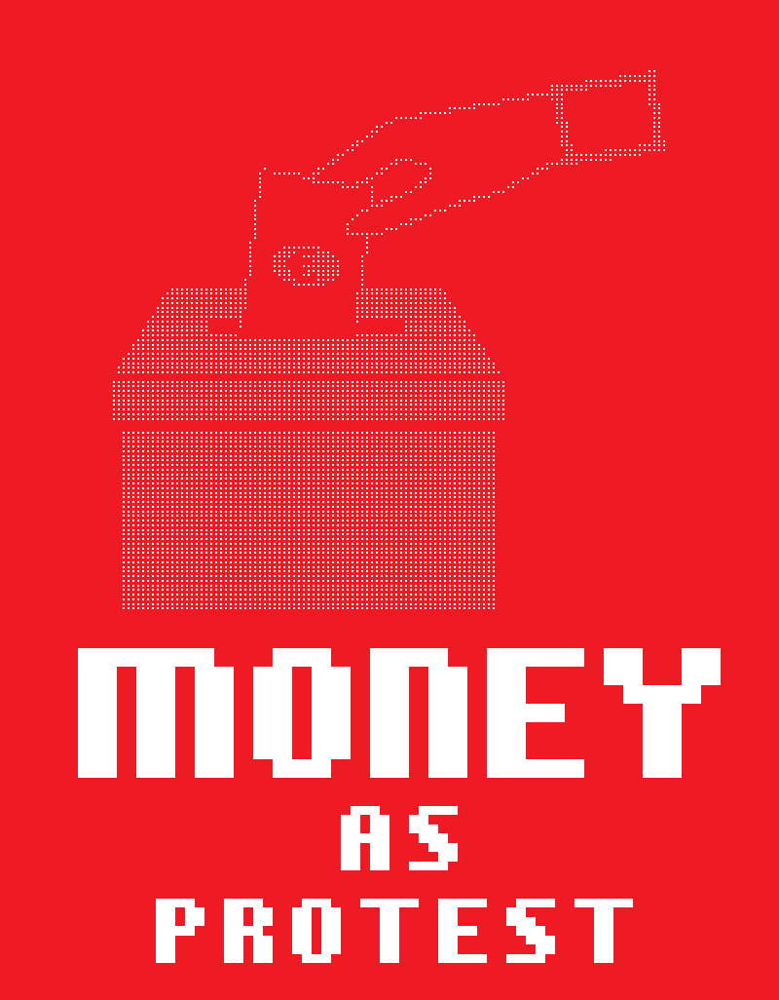

# ballot vote with money

Create ANSI version of this poster https://github.com/badele/money-as-protest

## French

```bash
ansi-compositor FR-ballot-vote.yaml | sed 's/Bk/BP1/g' | sed 's/R0/BP1/g' >  FR-ballot-vote.neo
splitans -f neotex -F ansi -V FR-ballot-vote.neo > output.ans
reset && cat output.ans && magick import -window $(xdotool getactivewindow) screenshot.png && magick screenshot.png -crop +0-348 -trim +repage FR-ballot-vote.png
```



## English

```bash
ansi-compositor EN-ballot-vote.yaml | sed 's/Bk/BP1/g' | sed 's/R0/BP1/g' >  EN-ballot-vote.neo
splitans -f neotex -F ansi -V EN-ballot-vote.neo > output.ans
reset && cat output.ans && magick import -window $(xdotool getactivewindow) screenshot.png && magick screenshot.png -crop +0-348 -trim +repage EN-ballot-vote.png
```


