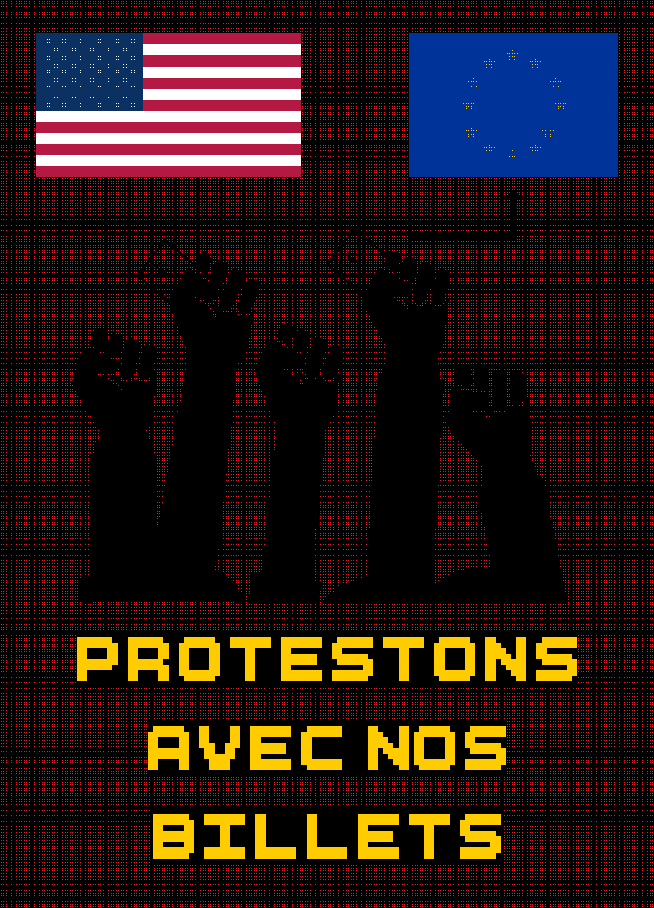
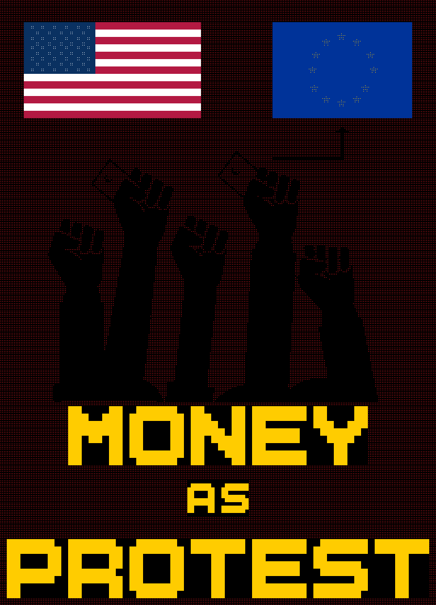

# Group fist raised

Create ANSI version of this poster https://github.com/badele/money-as-protest

## French

```bash
ansi-compositor FR-group-fist-raised.yaml > FR-group-fist-raised.neo
splitans -f neotex -F ansi -V FR-group-fist-raised.neo > output.ans
reset && \cat output.ans && magick import -window $(xdotool getactivewindow) screenshot.png && magick screenshot.png -crop +0-330 -trim +repage FR-group-fist-raised.png
```



## English

```bash
ansi-compositor EN-group-fist-raised.yaml > EN-group-fist-raised.neo
splitans -f neotex -F ansi -V EN-group-fist-raised.neo > output.ans
reset && \cat output.ans && magick import -window $(xdotool getactivewindow) screenshot.png && magick screenshot.png -crop +0-330 -trim +repage EN-group-fist-raised.png
```


